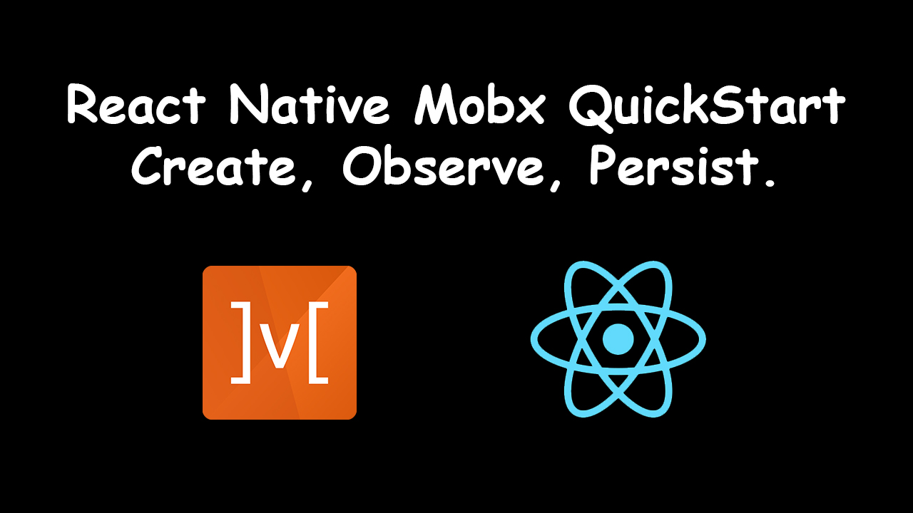

# React Native with Mobx QuickStart. Create, Observe, Persist. 

This is a showcase tutorial on how to set up Mobx in your React Native application. You will find how to create a store, observe it changes inside the React components and persist changes on app close. 

[Watch on YouTube](https://youtu.be/N7QbRgaIdEY)

